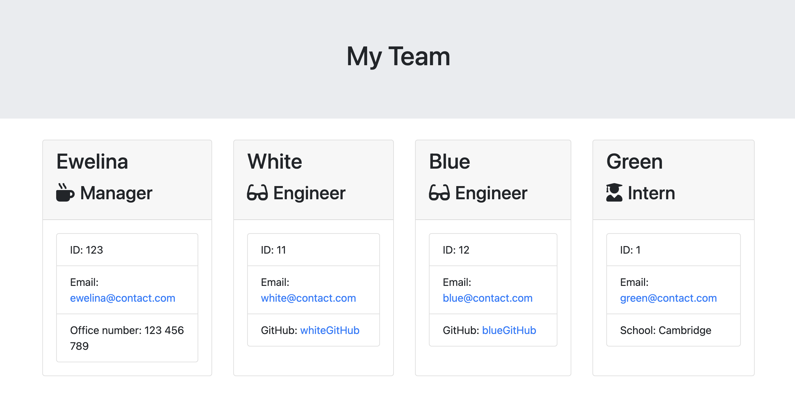

# Module 12 Object-Oriented Programming: Team Profile Generator

## Overview

A Node.js command-line application that takes in information about employees on
a software engineering team, then generates an HTML webpage that displays
summaries for each person.

[](#license)

## Test status


## Table of Contents

- [Installation](#installation)
- [Usage](#usage)
- [Requirements](#requirements)
- [Test Status](#test-status)
- [Credits](#credits)
- [License](#license)

## Installation

Uses the [Inquirer package](https://www.npmjs.com/package/inquirer).

Install Inquirer package using following instruction in your terminal:

```
npm install --save inquirer@^8.0.0
```

All tests pass using the [Jest package](https://www.npmjs.com/package/jest).
Make sure you change in package.json test property to 'jest':

```
 "scripts": {
    "test": "jest"
  }
```

The application will be invoked by using the following command:

```bash
node index.js
```

## Usage

A sample HTML file generated using the app:
https://github.com/EAmrogowicz/team-profile-generator/blob/main/output/team.html

GitHub source files: https://github.com/EAmrogowicz/team-profile-generator

The following image shows a mock-up of the generated HTML’s appearance and
functionality:



The styling in the image is just an example, so feel free to add your own.

## Requirements

A command-line application that accepts user input. Create classes for each team
member provided and export them. The tests for these classes (in the `tests`
directory) review the functionality of the code.

- The first class is an `Employee` parent class with the following properties
  and methods:

  - `name`
  - `id`
  - `email`
  - `getName()`
  - `getId()`
  - `getEmail()`
  - `getRole()`&mdash;returns `'Employee'`

- The other three classes will extend `Employee`.
- In addition to `Employee`'s properties and methods, `Manager` will also have
  the following:
  - `officeNumber`
  - `getRole()`&mdash;overridden to return `'Manager'`
- In addition to `Employee`'s properties and methods, `Engineer` will also have
  the following:
  - `github`&mdash;GitHub username
  - `getGithub()`
  - `getRole()`&mdash;overridden to return `'Engineer'`
- In addition to `Employee`'s properties and methods, `Intern` will also have
  the following:
  - `school`
  - `getSchool()`
  - `getRole()`&mdash;overridden to return `'Intern'`
- Finally, the code validates the user input to ensure that user input is in the
  proper format.

- When a user starts the application then they are prompted to enter the **team
  manager**’s:
  - Name
  - Employee ID
  - Email address
  - Office number
- When a user enters those requirements then the user is presented with a menu
  with the option to:
  - Add an engineer
  - Add an intern
  - Finish building the team
- When a user selects the **engineer** option then a user is prompted to enter
  the following and then the user is taken back to the menu:
  - Engineer's Name
  - ID
  - Email
  - GitHub username
- When a user selects the intern option then a user is prompted to enter the
  following and then the user is taken back to the menu:
  - Intern’s name
  - ID
  - Email
  - School
- When a user decides to finish building their team then they exit the
  application, and the HTML is generated.

- The `render` function will generate and return a block of HTML including
  templated divs for each employee

  - function pass in an array containing all employee objects;

- Creates an HTML file using the HTML returned from the `render` function.
  - Writes it to a file named `team.html` in the `output` folder.
  - Create the `output` folder if doesn't exist.

## Credits

N/A

## License

Please refer to the LICENSE in the repo.
